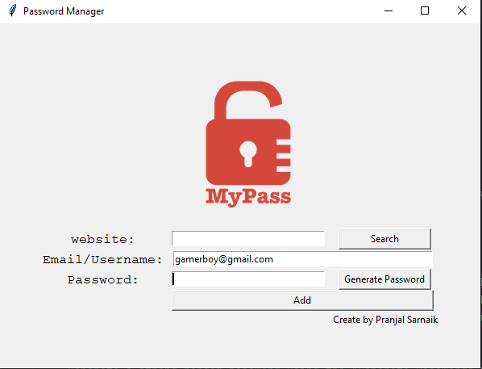
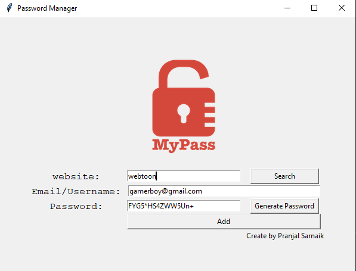

# Password Manager
A Password Manager with a GUI to store, manage, and retrieve passwords securely. It generates random passwords, copies them to the clipboard, and stores credentials in a JSON file with search and validation features.  

## Screenshots
, 

## Author
Pranjal Sarnaik

## Features
- Generates strong random passwords.  
- Automatically copies passwords to the clipboard.  
- Validates input to ensure no fields are empty.  
- Saves credentials in `data.json` and allows searching.  
- Simple GUI with a lock icon for design appeal.  

## Level
Intermediate

## Tech Stack
Python | Tkinter | JSON | File Handling | Clipboard Handling | Error Handling

## How to Run
1. Clone the repo:  
   ```bash  
   git clone https://github.com/pranjalco/password-manager-intermediate.git

2. Run(Also install required libraries):
    ```bash  
   pip install pyperclip
   python app.py

**Created by Pranjal Sarnaik**  
*Released under the MIT License*